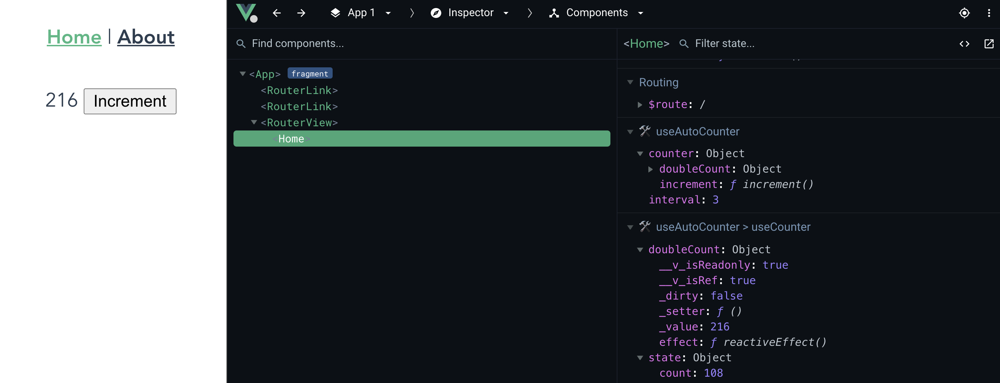

# Vue composition function insights

This project aims at providing insights into the internal state of composition functions.
I described the idea and motivation in on [Medium](https://medium.com/js-dojo/why-we-still-need-state-management-systems-in-vue-3-but-not-the-way-you-think-63b79d2a71b1).

This project is highly experimental and work in progress. It is not yet published to npm.

## What this does (until now)

It displays the internal state (declared with `const = `) in the VueJS Devtools:



## Setup

### Build & install

As this package is not yet published you need to build & install locally.

```bash
git clone git@github.com:JohannesLamberts/vue-composition-function-insights.git
cd vue-composition-function-insights
yarn install
yarn build
```

With [yalc](https://github.com/wclr/yalc) (`yarn global add yalc`):
```bash
# in vue-composition-function-insights
yarn publish.local

# in your vue3 app
yalc add vue-composition-functions-with-devtools
yalc add babel-plugin-vue-composition-functions-with-devtools
yarn
```

_Note: You also install i.e. using `yarn link`, but `yalc` is the best choice IMHO._

### Integration

#### Add babel plugin

```js
// babel.config.js
module.exports = {
  plugins: ['vue-composition-functions-with-devtools'],
}
```

#### Integrate into VueJS Devtools

```ts
// main.ts
import { installVueJSDevtoolsIntegration } from 'vue-composition-function-insights'
import { createApp } from 'vue'

const app = createApp(App)

installVueJSDevtoolsIntegration(app)
```

#### Track composition functions

```ts
import { withDevtools } from 'vue-composition-function-insights'

// wrap any composition function with `withDevtools` 

export const useCounter = withDevtools(
  // pass a name first
  'useCounter',
  // second argument is the composition function
  () => {
    const state = reactive({
      count: 0,
    })

    const increment23 = function increment23() {
      state.count++
    }

    const doubleCount = computed(() => state.count * 2)

    return {
      doubleCount,
      increment: increment23,
    }
  },
)
```
